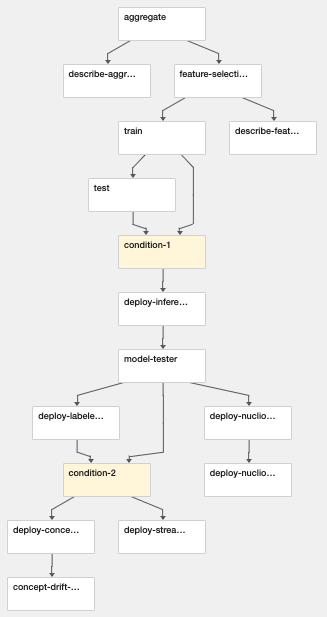

# Network Operations - MLRun MLOps Demo
---
This demo shows a full ML Pipeline for error prediction based on network device telematry using MLRun.

In this demo we show:
- Managing an MLRun Project
- Using github as a source for functions to use in our pipeline workflows
- Use MLRun logging to track results and artifacts
- Running a Kubeflow Pipeline using MLRun
- Deploy live endpoints
- Deploy Concept Drift

The demo applications are tested on the Iguazio's Data Science PaaS, and use Iguazio's shared data fabric (v3io), and can be modified to work with any shared file storage by replacing the `apply(v3io_mount())` calls with other KubeFlow volume modifiers (e.g. `apply(mlrun.platforms.mount_pvc())`) . You can request a free trial of Iguazio PaaS.

## Running the demo
---
Pre-requisites:
* A Kubernetes cluster with pre-installed KubeFlow, Nuclio.
* MLRun Service and UI installed, [see MLRun readme](https://github.com/mlrun/mlrun).

1. Clone this repo to your own Git. 
2. in a client or notebook properly configured with MLRun and KubeFlow run:

`mlrun project my-proj/ -u git://github.com/<your-fork>/demo-network-operations.git`

3. Run the [Generator](notebooks/generator.ipynb) notebook to create the metrics dataset.

4. Open the [project notebook](project.ipynb) and follow the instructions to develop and run an automated ML Pipeline.

> Note: alternatively you can run the `main` pipeline from the CLI and specify artifacts path using:

`mlrun project my-proj/ -r main -p "/User/kfp/{{workflow.uid}}/"`

## Files
### Notebooks
* [Generator notebook (Generate metrics dataset)](notebooks/generator.ipynb)
* [Preprocessor notebook](notebooks/preprocessor.ipynb)
* [Model server notebook](notebooks/server.ipynb)
* [Labeled stream creator](notebooks/labeled_stream_creator.ipynb)
* [Project creation and testing notebook](project.ipynb) 

### Project Files
* [Project spec (functions, workflows, etc)](project.yaml)

### Workflow code
* [Workflow code (init + dsl)](src/workflow.py)

## Pipeline

 

 

